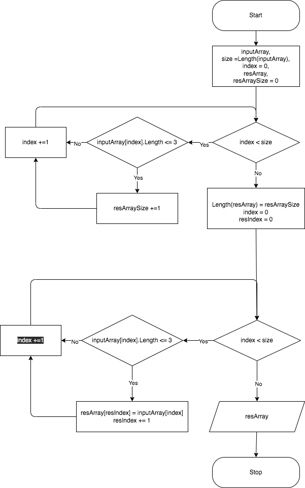

# Итоговая проверочная работа за 1 четверть обучения

## Задача

    Написать программу, которая из имеющегося массива строк формирует массив из строк, длина которых меньше или равна 3 символа.

## Решение

Основной алгоритм решения задачи представлен на бок-схеме: 

Он состоит из двух этапов:

- на первом этапе находится количество строк `resArraySize` исходного массива `inputArray` длина которых 3 символа и меньше;
- на втором - создается результирующий массив `resArray` с размером `resArraySize` и заполняется строками из массива `inputArray` длина которых 3 символа и меньше.

Алгоритм реализован в методе `GetThreeCharStrings`. На вход метод получает предварительно сформированный произвольный массив строк `inputArray`, на выходе возвращает массив строк входного массива, длина которых 3 символа и меньше.

    

